# ML operationalization with model deployment and pipelines

This project explores Azure capabilities for model deployment (API) and automation of model training with pipelines.

## Architectural Diagram

The architectural diagram below represents the process of model training and model consumption. Multiple models are trained within an AutoML run using a registered dataset. The best model is deployed to an endpoint with authentication (Azure Container Instance deployment). As soon as it is deployed, clients can interact with the model - send input data and receive predictions. 

## Key Steps

This section gives details on the key steps in model training, model deployment as well as automation of the training with a pipeline.

### Model training
Registering datasets with Azure offers an advantage of reusability of data in multiple projects/experiments. A dataset can be registered within configuring an autoML run, which was done in this project. The *Bank-marketing* dataset on the screenshot below was registered within creation of the first autoML run.

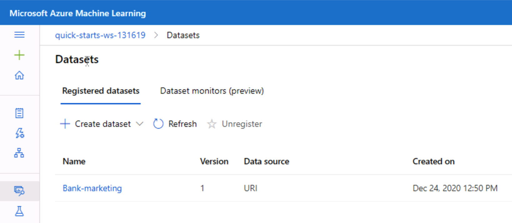

The autoML run resulted in a list of models from which the *VotingEnsemble* is qualified as the best according to the selected performance metric (as depicted on the right part of the screenshot below). The best model achieved 91.8% accuracy. 
The *Details* tab of the experiment provides also other pieces of information about the comleted experiment: its status, duration, unique run ID, etc.

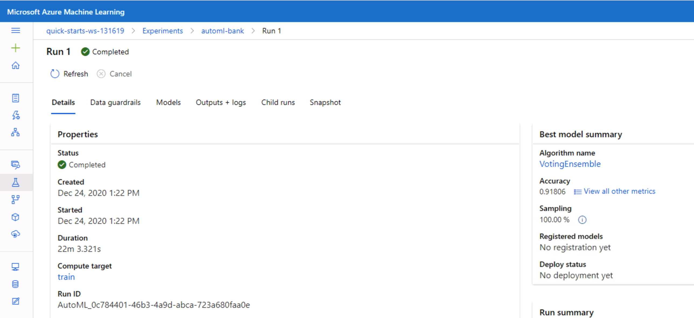

### Model deployment

The best model from the training step was deployed to a *bank-marketing-automl-deploy* endpoint with key authentication. This secures access to the endpoint, the chosen key-based authentication requires provision of a key while sending requests to the endpoint. Enabling application insights for the endpoint permit extended performance monitoring of the model API, which would be especially useful when the load on the endpoint is high. Acting on performance monitoring results can significantly contribute to user experience of the model consumers (e.g. in terms of latency).    

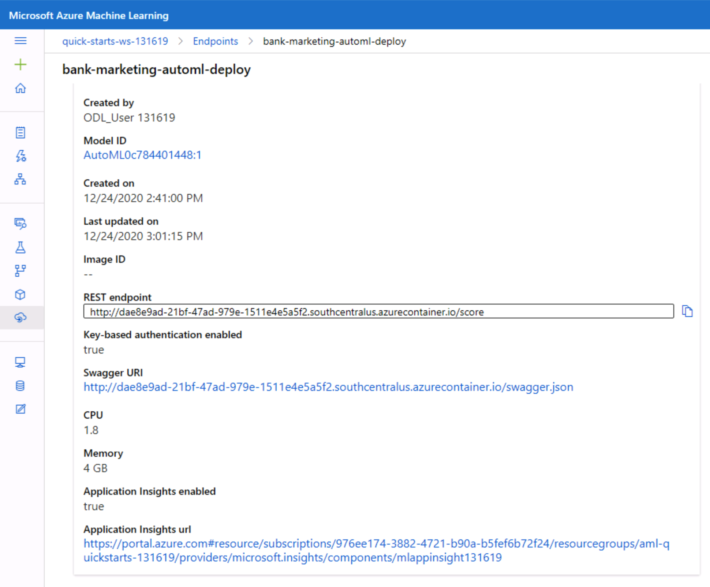

Various visualization of the endpoint performance can be accessed through the Azure portal. Additionally, logs from the endpoint can be accessed programmatically. The screenshot below demonstrates the output of the [logs.py Python script](logs.py) containing the endpoint ID and printing out the logs. The programmatic access can be embedded into the automatic monitoring solutions. 

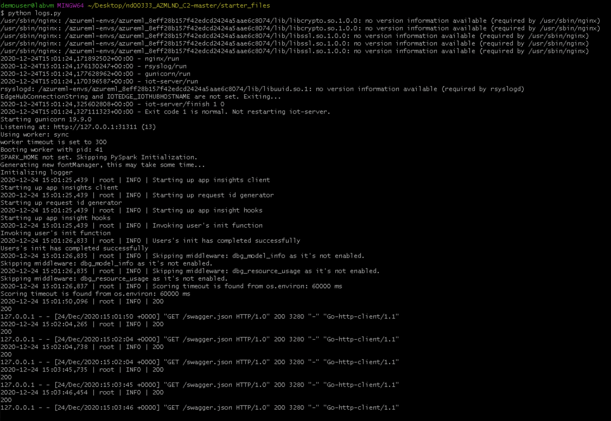

Model deployment process in Azure generates Swagger specification of the API (standardized format of API description). The Swagger UI on the screenshot below reads the specification from local and conveniently demonstrates available endpoints. The */score* endpoint is ready to receive input data (requirements to format is provided within the Swagger specification) and output prediction. 

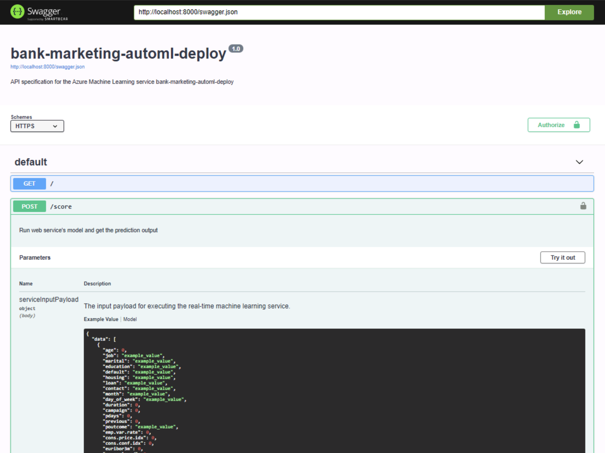

Depending on the use of the endpoint, one can be interested in manual and programmatic access to it. The [endpoint.py Python script](endpoint.py) gives an example of programmatic access to the model endpoint by specifying the REST endpoint URI, the authentication key (as this authentication was enabled) and the input data. A more robust solution would source the endpoint URI, key and input data from outside the Python script. Sending two sets of input variables resulted in two responses:

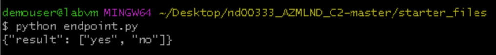

Before exposing the endpoint to users it is a good idea to test its performance under load. Load testing the model showed good performance of the endpoint - a mean of 77 ms per request.

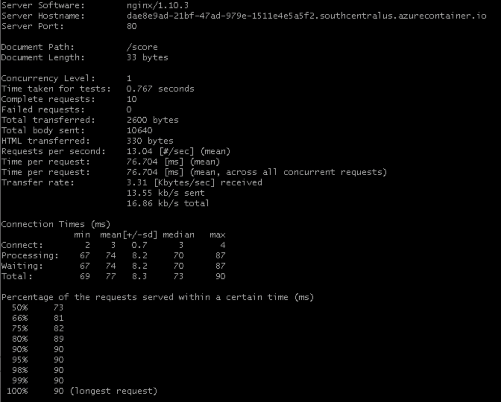

### Automation with a pipeline

Pipelines offer automation of ML processes and enable their reusability even by other users (trigger via a REST endpoint).
A pipeline in this projec includes consuming the dataset and training the model with AutoML.

The pipeline is formulated and triggered from the [Jupyter notebook](aml-pipelines-with-automated-machine-learning-step.ipynb). The details from the runs can be conviniently accessed from the Azure UI. Similar to the *Experiments* section, the *Pipeline runs* on the screenshot below show the status, duration and other details.

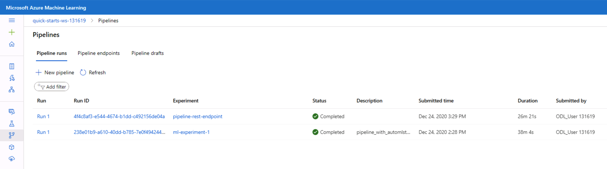

Zooming in into a pipeline shows its steps: a dataset input (*BankMarketing* registered dataset) and an AutoML module. 

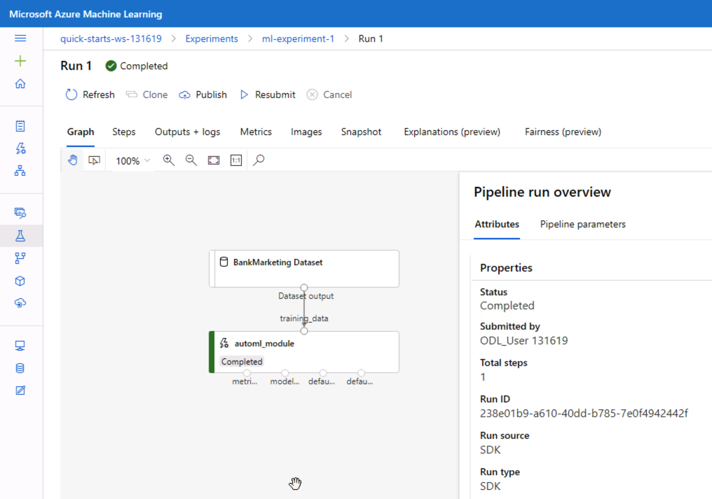

Alternatively, one can visualize the steps from the notebook using the *RunDetails* widget. The screenshot below show the same steps as displayed in the UI. Different representations of the same information can serve different users (e.g. model developer in the notebook and other team members in the UI).

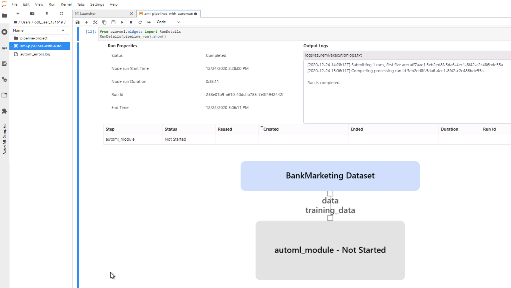

Sharing the pipelines with colleagues or customers is achieved by their publishing. Published pipelines enable interaction with pipelines for others via a REST endpoint. The screenshot below depicts an active REST endpoint to interact with the pipeline described in this section.

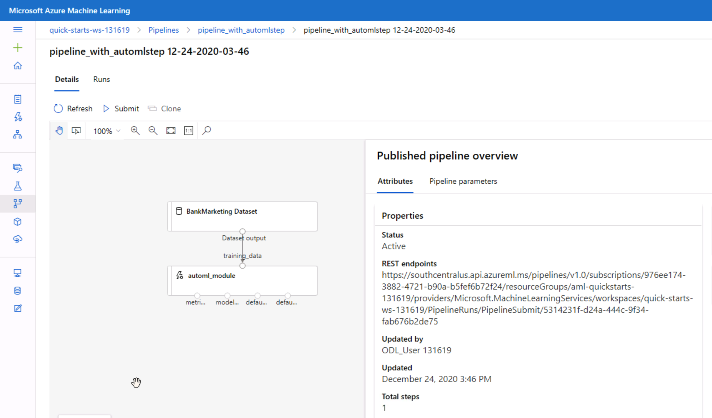

All pipeline endpoint within a particular ML Studio are accessible via *Pipelines* > *Pipeline endpoints* tab. For example, the screenshot below demonstrates the *Bankmarketing Train* endpoint in the *Running* state.

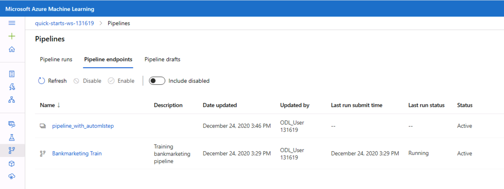

## Screen Recording

This [screen recording](https://www.youtube.com/watch?v=9QVyKiDleyg)  gives a short overview of the project in action.

## Future improvements

Pipelines are a great way to automate work, however, automation can profit from some flexibility. Variables can be added to pipelines to increase their flexibility when used by others. 

Pipeline schedules can be created from the Notebook as well. 