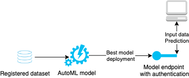

# ML operationalization with model deployment and pipelines

This project explores Azure capabilities for model deployment (API) and automation of model training with pipelines.

## Architectural Diagram

The architectural diagram below represents the process of model training and model consumption. Multiple models are trained within an AutoML run using a registered dataset. The best model is deployed to an endpoint with authentication (Azure Container Instance deployment). As soon as it is deployed, clients can interact with the model - send input data and receive predictions. 

## Key Steps

### Model training
An autoML run used the registered *Bank-marketing* dataset.

The autoML run resulted in a list of models from which the *VotingEnsemble* is qualified as the best according to the selected performance metric.

### Model deployment

The best model from the training step was deployed to a *bank-marketing-automl-deploy* endpoint with key authentication and application insights enabled.

Logs from the endpoint can be accessed programmatically. 

The automatically created Swagger specification of the API can be viewed in the UI.

One can interact with the endpoint programmatically. Sending two sets of input variables resulted in two responses:

Load testing the model showed good performance of the endpoint:

### Automation with a pipeline

A pipeline includes consuming the dataset and training the model with AutoML.

The pipeline runs show successful completion.

Zooming in into a pipeline shows the steps: a dataset input and an AutoML module.

From the notebook, the *RunDetails* widget demonstrates the step runs.

Pipeline endpoints show pipeline with a status (*Running* for the *Bankmarketing Train* endpoint).

Published pipelines enable interaction with pipelines for other team members via a REST endpoint.

## Screen Recording

This [screen recording](https://www.youtube.com/watch?v=9QVyKiDleyg)  gives a short overview of the project in action.

## Future improvements

Pipelines are a great way to automate work, however, automation can profit from some flexibility. Variables can be added to pipelines to increase their flexibility when used by others. 

Pipeline schedules can be created from the Notebook as well. 